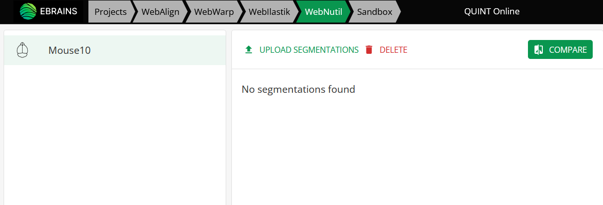

**Upload your own segmentations**
===================================

Webilastik can be used to identify the features to quantify in the section images by image segmentation. Alternatively, you can upload your own segmentations to the online workbench. These can be created using any image analysis software (e.g FIJI, QuPath, Cellpose or ilastik), as long as they meet the requirements of the QUINT online workflow. 

**Segmentation requirements**
------------------------------

1. **Format**: Must be in PNG format, with the objects to quantify displayed using one RGB colour code (e.g. red = 255, 0, 0).

2. **File naming**: the segmentations must have identical file names to the original images uploaded to the workbench. They must comply with the `QUINT file naming convention <https://quint-webtools.readthedocs.io/en/latest/Requirements.html>`_.

3. **Image proportions**: Must have the same proportions as the images uploaded to the online workbench, but are usually not the same size as the original images. It is recommended to downscale the images prior to segmentation using a consistent scaling factor for the whole image series. This has several advantages. It can improve the quality of segmentation as it removes noise from the images, and it speeds up WebNutil analysis, preventing crashes due to insufficient memory. 

.. tip::

    The aim is to downscale the images as much as possible but without losing the information from the images that is actually important. The optimal scaling factor is determined by trial and error and must be applied consistenty to all the images in the image series. 

4. **Image size**: We recommend using segmentations up to a maximum size of 14000 x 10000 pixels. Images larger than this may also work. However crashing due to insufficient memory may occur. It is recommended to downscale the images as much as possible before segmenting them.

.. tip::

    `QuPath: <https://qupath.github.io/QuPath>`_ is an alternative that can be used to generate the segmentations. In some cases QuPath may perform better than ilastik. See `this iprotocol <https://www.protocols.io/view/quint-workflow-for-fluorescence-4r3l22y6jl1y/v2>`_ for how to use QuPath for the QUINT workflow.

    `FIJI: <https://imagej.net/software/fiji/>`_ is also useful for generating segmentations. 

 