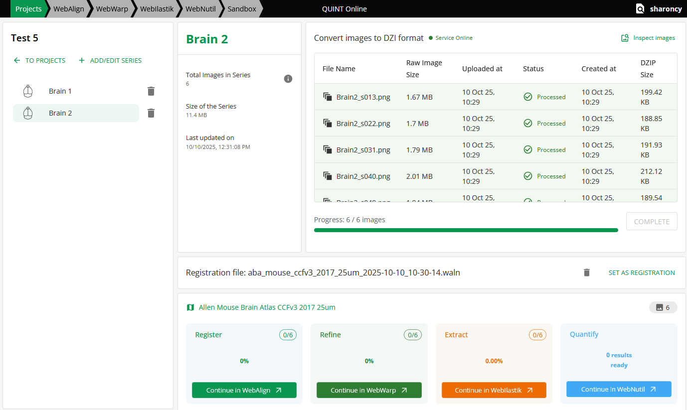

**CreateBrain**
================

Once you are logged in to the Online Workbench you are ready to start your analysis. The first step is to upload the images to be analysed. You then combine them into an image series corresponding to one brain using the CreateBrain app. CreateBrain also converts the images to the DZIP format required by the tools.  

Are there any image requirements?
----------------------------------

1. Images in TIFF, JPG or PNG format that display the brain sections can be used in the tools. 
2. To be compatible with the tools, each image files must be named with a unique ID before it is are uploaded to the Online Workbench, e.g. _s0030. See the tip below.

.. tip::
   Images of brain section corresponding to one brain are analysed together in an image series. 

   For the images to be placed in the correct order in the tools, they must be named with a unique identifier starting with _s followed by a unique number corresponding to the order and spacing of the section in the brain. For example, _s001, _s003, _s005 for serial sections with every other section missing.

.. image:: images/NamingConvention.PNG

How do I upload my images? 
----------------------------

1. In the Online Workbench, create a new project, give it a title and simple description. Then "Launch Project".
2. You are presented with an empty project. It may take some minutes for the storage bucket to load (be patient). 
3. Go to "upload files", select the images to be analysed (make sure they comply with the file naming convention).    
4. Once the image files are visible in the project, highlight the files corresponding to one brain and press "Create Brain from Selection".
5. Give the brain an ID (no spaces!) and select the relevant atlas (mouse or rat). It takes time for the brain series to be created, so be patient.

6. Once your brain is visible in "Prepared Brains", you're ready to start the analysis. Go to the "apps & analysis" tab and use the tools in turn.

* Register your data to the atlas. Use `WebAlign first <https://quint-webtools.readthedocs.io/en/latest/WebAlign.html>_', followed by WebWarp. 
* Extract the features to be quantified. Use WebIlastik. 
* Perform the quantification. Use NutilWeb. 
* View and explore your results. Use MeshView.  

.. image:: images/apps.PNG  

   
