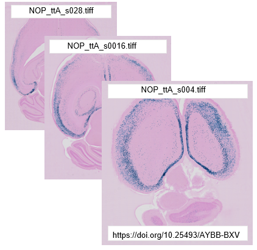

**Data Upload**
================

Once you are logged in to the EBRAINS Rodent Workbench you are ready to start your analysis. The first step is to create a project and upload your brain image series to be analysed. You then convert the images to DZI format, combine the images into a .waln file and select the reference atlas to use for analysis.

Are there any image requirements?
----------------------------------

1. Images in TIFF, JPG or PNG format displaying brain sections can be used in the tools. 
2. To be compatible with the tools, the image files must be named with a unique ID before they are uploaded to the EBRAINS Rodent Workbench, e.g. _s0030.

.. tip::
   Images of brain section corresponding to one brain are analysed together in an image series. 

   For the images to be placed in the correct order in the tools, they must be named with a unique identifier starting with _s followed by a unique number corresponding to the order and spacing of the section in the brain. For example, _s001, _s003, _s005 for serial sections with every other section missing. See `Preparing the images for upload <https://quint-webtools.readthedocs.io/en/latest/Requirements.html>`_.
  

How do I upload my images? 
----------------------------

1. In the Rodent Workbench, create a new project, give it a name and then open the project.
2. You are presented with an empty project. Press "Add /Edit series" to upload images series corresponding to each brain to the project. If you have images from more than one brain, upload them as separate image series (e.g. Brain 1, Brain 2, Brain 3, etc).  
3. Once the image series is visible in the project, select it to reveal series information. Press "Convert" to convert the images to the DZI format required by the tools. Depending on the size of the images, this process may take some time. The conversion process will continue if you log out, so feel free to log out and log in at a later time. 
4. Once the images are converted, select the reference atlas to use for analysis (mouse or rat) amd press "Generate" to create a registration file. You are now ready to start using the tools.  

.. image:: images/CreateBrain.PNG

* Register your data to the atlas: use `WebAlign <https://quint-webtools.readthedocs.io/en/latest/WebAlign.html>`_ first, followed by `WebWarp <https://quint-webtools.readthedocs.io/en/latest/WebWarp.html>`_. 
* Extract the features to be quantified: use `WebIlastik <https://quint-webtools.readthedocs.io/en/latest/WebIlastik.html>`_. 
* Perform quantification: use `NutilWeb <https://quint-webtools.readthedocs.io/en/latest/NutilWeb.html>`_. 
* View and explore your results: use `MeshView <https://quint-webtools.readthedocs.io/en/latest/MeshviewWeb.html>`_.

 

   
