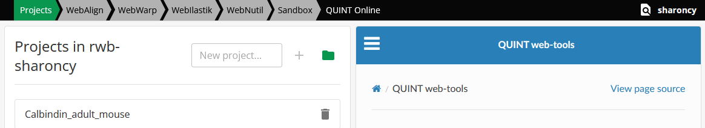
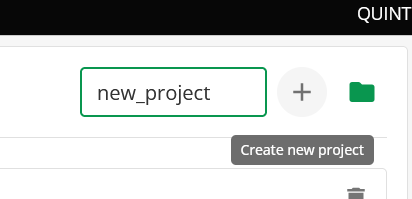
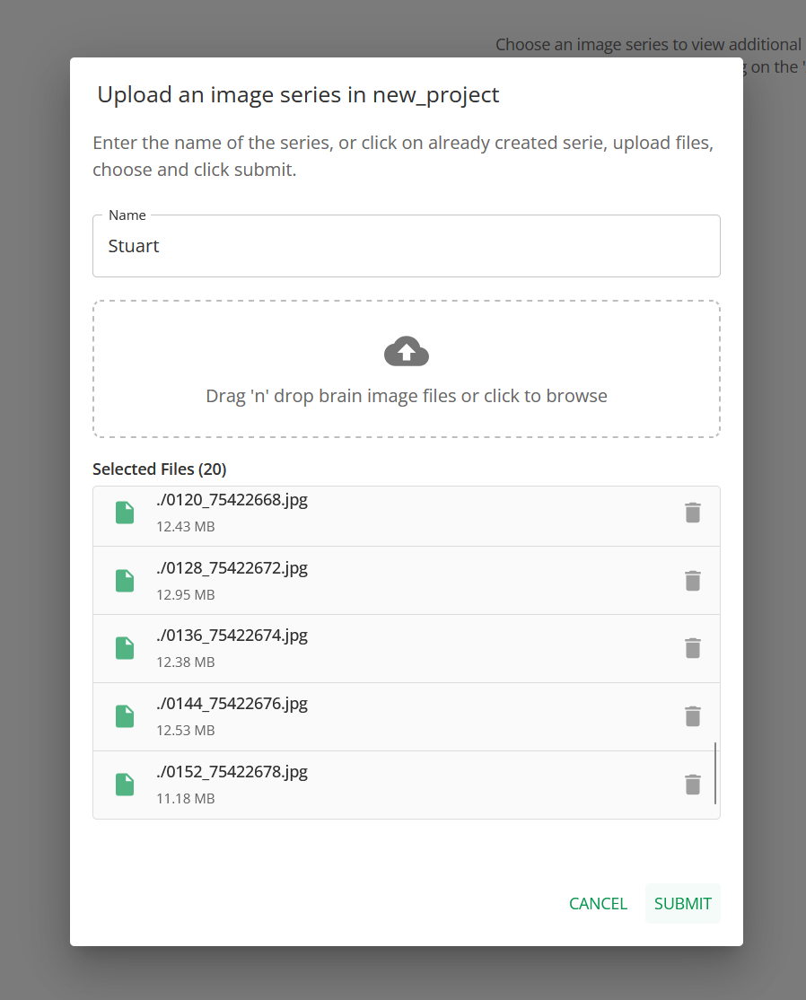

**My online Workspace**
=======================

Welcome to your QUINT online workspace! This is where you'll manage your projects and data for the QUINT online workflow.

**Getting Started with Your online Workspace**
-----------------------------------

Your online workspace provides a centralised location to:

* Organise your research projects in EBRAINS infrastructure
* Upload and manage brain section image data
* Track analysis progress
* Access your results and outputs

Your workspace is comprised of your user space, tabs pointing to applications which allow you to carry out QUINT workflow, in order, and access to project management and documentation.

**Workspace Features**
------------------

Your online workspace includes several key features to enhance your research workflow:

* **Project Management**: Create and manage multiple research projects, each supporting multiple series.
* **Data Upload**: Easily upload and organise your brain image data and access it from any device with your EBRAINS account.
* **Analysis Tracking**: Monitor the progress of your analyses with bespoke QUINT workflow focused tracking dashboard.
* **Result Access**: Quickly access your analysis results and outputs, make use of the multiple visualisation tools integrated into the workflow.

**Project Management**
~~~~~~~~~~~~~~~~~~

Create and organise multiple research projects within your workspace. 

Each project can contain:

* Multiple brain image series 

**Data Upload**
~~~~~~~~~~~~~~~~~~
Once a project is created, you can upload your brain image data to the project, via the ADD/EDIT SERIES button.

**Next Steps**
----------

Once you're familiar with your workspace, proceed to:

* :doc:`Requirements` - Check system requirements
* :doc:`CreateBrain` - Upload your brain image data

**Need Help?**
----------

If you need assistance with your workspace, check out:

* :doc:`Contact` - Get in touch with support
* :doc:`Publications` - Read about QUINT methodology
