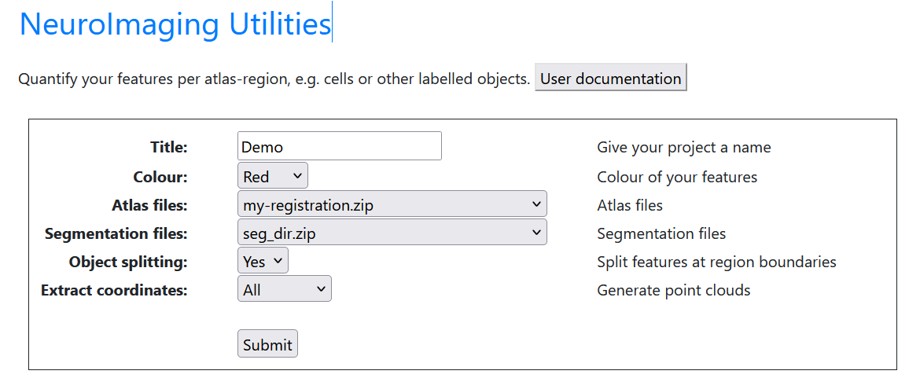

**NutilWeb**
==============

1. Segmentations

* Must comply with _sXXX naming convention
* in zipped folder titled: seg_dir.zip

2. Atlas maps and JSON

* Downloaded from WebAlign using "Export overlays" button. This creates a zipped folder containing flat files and the anchorings.json. 

FlatChecker

https://www.nesys.uio.no/FlatChecker/ 

