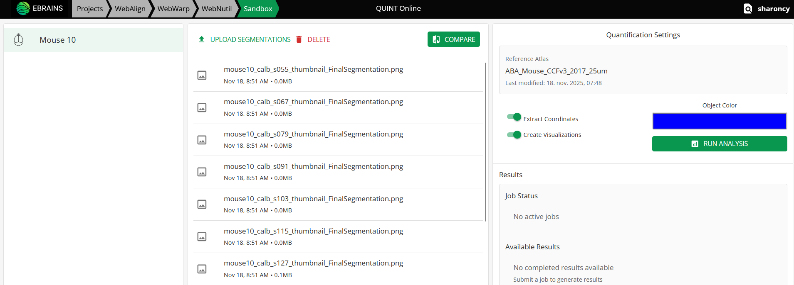

**WebNutil**
==============

WebNutil is used to perform the quantification step in the QUINT online workflow.  It combines the result of the atlas-registration steps (using WebAlign and WebWarp) with the result of the feature extraction step (using Webilastik or another software) to generate a series of reports. These include counts of segmented features and area fraction per reference atlas regions, and point clouds representing the features in 3D atlas space. The results can be downloaded as CSV and JSON files or used interactively in the plotting Sandbox and MeshView atlas viewer.

**How to open WebNutil?**
-------------------------

.. tip::     
    As WebNutil uses the output of the atlas-registration and feature extraction steps to perform quantification, these steps must be completed before attemping WebNutil analysis.

1. Navigate to WebNutil using the button in your project or using the WebNutil tab at the top of the screen.
 

2. If you have used Webilastik to create segmentations, these will be visible in the middle panel. If you have created your own segmentations using an external software, upload these to WebNutil using the "upload segmentations" button.

3. Once the atlas-registration step is complete and segmentations are available for all your sections (either created with webilastik or uploaded manually), you are ready to perform WebNutil analysis. To do this, select the object colour to quantify in your segmentations in the right hand panel and press "Run Analysis". The results will automatically appear in the results panel when the analysis has completed (this may take some time). 

4. Once analysis is complete, download your results and explore the results interactively using the plotting Sandbox and MeshView atlas viewer. 