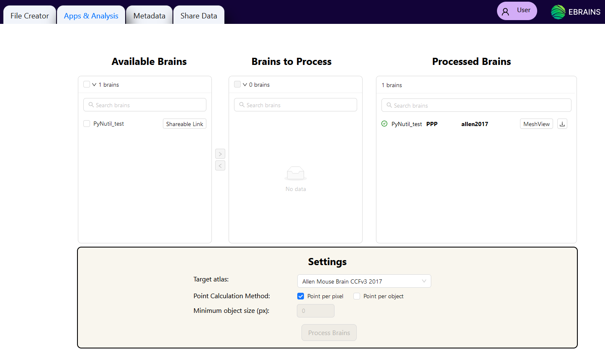

**NutilWeb**
==============

Nutilweb is a tool for performing brain-wide quantification of features relative to a reference brain atlas, and for extracting point clouds for visualising the features in 3D. It combines the output from the atlas-registration step with WebAlign and WebWarp and the feature extraction step with Webilastik.

How to open Nutilweb?
-------------------------

In “Apps & Analysis”, click “Nutilweb" to reveal brains available to be processed. 

   
