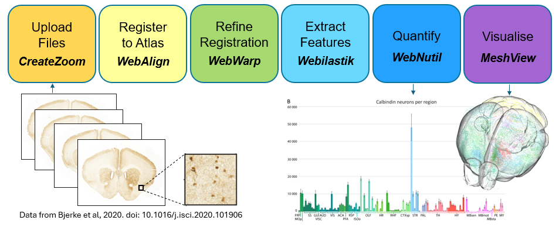

**What is the QUINT online workflow?**
======================================
   
The QUINT online workflow supports the analysis of 2D rodent brain microscopy data, allowing brain-wide mapping and regional quantification using a reference brain atlas. The workflow is used to quantify cells and establish maps of cell distribution, receptor densities, connectivity patterns or pathological protein accumulation in the brain. It combines the use of a series of web-applications integrated in an online platform, accessible through EBRAINS. 

Which atlases are supported?
-----------------------------

1. Allen Mouse Brain Atlas Common Coordinate Framework version 3 (2017) (CCFv3)
2. Waxholm Atlas of the Sprague Dawley rat, version 3 and 4 (WHS rat brain atlas).

.. image:: images/atlases.PNG

What is the output of the workflow?
---------------------------------

The QUINT workflow generates reports with feature counts and area fraction in reference atlas regions, and point clouds that can be used to visualise the features in 3D reference space using our Meshview Atlas Viewer.  

.. image:: images/results.PNG

How to access the QUINT online workflow?
----------------------------------------

The QUINT online workflow is under development. To access an alpha version, go to the `Rodent Workbench <https://rodentworkbench.apps.ebrains.eu/>`_, register for an EBRAINS account, and login. As it is currently under development, use for testing purposes only. Your feedback is much appreciated. 

.. tip::   
   A mature version of the QUINT workflow is available through the use of a series of standalone desktop applications, `learn more here <https://quint-workflow.readthedocs.io/en/latest/>`_ (QuickNII, VisuAlign, ilastik and Nutil). The online version is being developed to provide tighter integration of the tools and benefits such as shareable microscopy viewer links and automated plotting.

 

