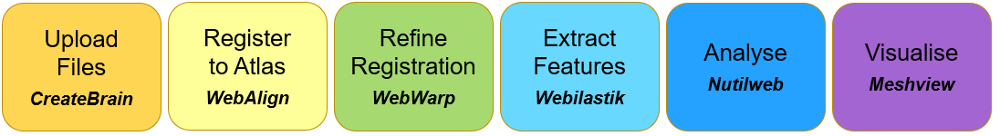

**What is the QUINT workflow?**
===============================
   
The QUINT workflow supports brain-wide quantification of labelled features in series of brain sections from mouse or rat brain. The quantification is performed with respect to a reference brain atlas. It generates counts and percentage coverage per atlas-region (area fraction), as well as point clouds for visualising the features in 3D atlas space. The following atlases are supported:

1. Allen Mouse Brain Atlas Common Coordinate Framework version 3 (2017) (CCFv3)
2. Waxholm Atlas of the Sprague Dawley rat, version 3 and 4 (WHS rat brain atlas).

.. tip::   
   The QUINT workflow is available in the `Online Workbench <https://ebrains-workbench.apps.hbp.eu/>`_ as a suite of web-based tools or offline as a series of downloable tools. 

`Learn more <https://neural-systems-at-uio.github.io/>`_. 
 

**How to access the tools?**
----------------------------------------

1. To access, go to the `Online Workbench <https://ebrains-workbench.apps.hbp.eu/>`_, register for an EBRAINS account and login.
2. Create a new project, give it a title and simple description. Then "Launch Project".
3. You are presented with an empty project. It may take some minutes for the storage bucket to load (be patient). 
4. Go to "upload files" and select the images to be analysed. Files must be named with a unique ID in the file name before they are uploaded, e.g. _s0030. See the tip below for more info. 

.. tip::
   Images of brain section corresponding to one brain are analysed together in an image series. 

   For the images to be placed in the correct order in the tools, they must be named with a unique identifier starting with _s followed by a unique number that corresponds to the section order and spacing in the brain, e.g. _s001, _s003, _s005. Rename the files before they are uploaded to the workbench.  
     
5. Once the image files are visible in the project, highlight the files corresponding to one brain and press "Create Brain from Selection".
6. Give the brain an ID (no spaces!) and select the relevant atlas (mouse or rat). It takes time for the brain to be created, so be patient.

.. image:: images/CreateBrain.PNG

7. Once your brain is visible in the "prepared brains", you're ready to start analysis. Go to the "apps & analysis" tab. 

.. image:: images/apps.PNG

   
