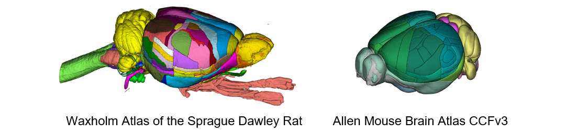

**What is the QUINT online workflow?**
======================================
   
The QUINT online workflow supports the analysis of 2D rodent brain microscopy data, allowing brain-wide mapping and regional quantification using a reference brain atlas. The workflow is used to quantify cells and establish maps of cell distribution, receptor densities, connectivity patterns or pathological protein accumulation in the brain. Different experimental datasets can be registered to the same atlas allowing spatial integration, analysis and navigation within a standardised coordinate system. 

The QUINT online workflow combines the use of a series of web-applications integrated in an online platform, accessible through EBRAINS. 

.. image:: images/QUINT_withexample.png

**Steps in the QUINT online workflow:**

1. **Prepare image for upload**.
2. **Upload the images** to the workbench and convert them to the DZI format required by the tools.
3. **Register the images to an atlas** in two steps using *WebAlign* (linear registration) and *WebWarp* (nonlinear refinement).  
4. **Extract features** to be quantified by segmentation using *Webilastik* or upload your own segmentations. 
5. **Quantify features** in atlas regions using *WebNutil*.
6. **Explore your results** using the *Sandbox*.
7. **Visualise** the results using the online 3D atlas viewer, *MeshView*.

**Which atlases are supported?**
-----------------------------

1. Allen Mouse Brain Atlas Common Coordinate Framework version 3 (2017) (CCFv3)
2. Waxholm Atlas of the Sprague Dawley rat, version 3 and 4 (WHS rat brain atlas).

**What is the output of the workflow?**
---------------------------------

The QUINT online workflow generates a series of reports in CSV and JSON format. These contain feature counts and area fraction in reference atlas regions, and atlas coordinates that can be used to visualise the features in 3D reference space using our Meshview Atlas Viewer. The results can be downloaded or explored using the plotting Sandbox. 

.. image:: images/results.PNG

 

