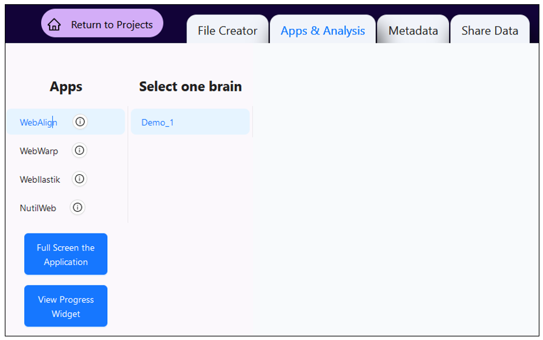

**What is the QUINT workflow?**
===============================
   
The QUINT workflow is an analysis solution for 2D rodent microscopy data, answering the need for brain-wide mapping and regional quantification. The workflow is used to quantify cells and establish maps of cell distribution, receptor densities, connectivity patterns or pathological protein accumulation in the brain. 

.. image:: images/QUINTsummary_2.PNG

Which atlases are supported?
------------------------------

The analysis is performed relative to a reference brain atlas, with the following atlases supported:

1. Allen Mouse Brain Atlas Common Coordinate Framework version 3 (2017) (CCFv3)
2. Waxholm Atlas of the Sprague Dawley rat, version 3 and 4 (WHS rat brain atlas).

.. image:: images/atlases.PNG

What is the output of the tools?
---------------------------------

The workflow generates object counts and area fraction in reference atlas regions, in addition to point clouds that can be used to visualise the features-of-interest in 3D atlas space with our Meshview Atlas Viewer.  

.. image:: images/results.PNG

.. tip::   
   The `QUINT workflow <https://neural-systems-at-uio.github.io/>`_ is available in the Online Workbench as a suite of web-based tools or offline as downloable tools.

   The Online Workbench offers tighter integration of the tools, shareable viewer links, metadata management and the option to submit directly to `EBRAINS <https://www.ebrains.eu/data/share-data>`_.

How to access the tools?
----------------------------------------

1. To access, go to the `Online Workbench <https://ebrains-workbench.apps.hbp.eu/>`_, register for an EBRAINS account and login.
2. Create a new project, give it a title and simple description. Then "Launch Project"
3. You are presented with an empty project. It may take some minutes for the storage bucket to load (be patient). 
4. Go to "upload files", select the images to be analysed. Files must be named with a unique ID before they are uploaded, e.g. _s0030. See the tip below. 

.. tip::
   Images of brain section corresponding to one brain are analysed together in an image series. 

   For the images to be placed in the correct order in the tools, they must be named with a unique identifier starting with _s followed by a unique number that corresponds to the section order and spacing in the brain. For example, _s001, _s003, _s005 for serial sections with every other section missing. Rename the files before they are uploaded to the workbench.  
     
5. Once the image files are visible in the project, highlight the files corresponding to one brain and press "Create Brain from Selection".
6. Give the brain an ID (no spaces!) and select the relevant atlas (mouse or rat). It takes time for the brain series to be created, so be patient.

.. image:: images/CreateBrain.PNG

7. Once your brain is visible in "Prepared Brains", you're ready to start the analysis. Go to the "apps & analysis" tab and use the tools in turn to register your data to the atlas (WebAlign first, followed by WebWarp), to extract the features to be quantified (WebIlastik), to perform the quantification (NutilWeb) and to view and explore your results (MeshView).  

How do I use the tools? 
------------------------

See the pages for each tool for user instructions.  

   
