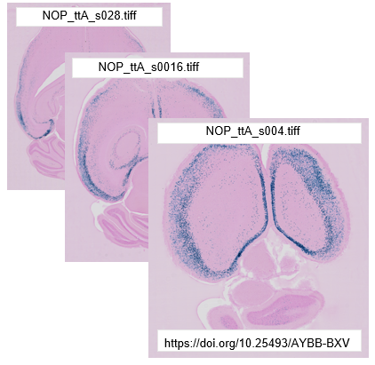

**Preparing images for upload**
==================================

The online workbench supports upload of images of histological brain sections at high-resolution in many image formats (TIFF, JPG, PNG). The images must be named according to the QUINT file naming convention. As the first step in the workflow, add a unique identifier to each image as described below.

**QUINT naming convention**
-------------------------------

.. note::
   Images of brain sections from one brain are analysed together in an image series. The unique IDs are used to position the histological images in the correct anatomical order in the QUINT tools. 

* To be compatible with the tools, the image files must be named with a unique ID reflecting the serial order and spacing of the sections in the brain. The format is: _sXXX with XXX representing the section number (not restricted to three digits). Choose a starting point in the brain, either the most anterior or most posterior section, and number all the sections relative to this. 
* Do not use periods "." or spaces (" ") in the file name. This will not work. 

**Example:**

For consecutive sections: _s0001, _s0002, _s0003

For every 2nd section: _s001, _s003, _s005

Every 10th section starting with 3rd section: _s003, _s013, _s023, _s033, etc. 

.. image:: images/NamingConvention.PNG

 

