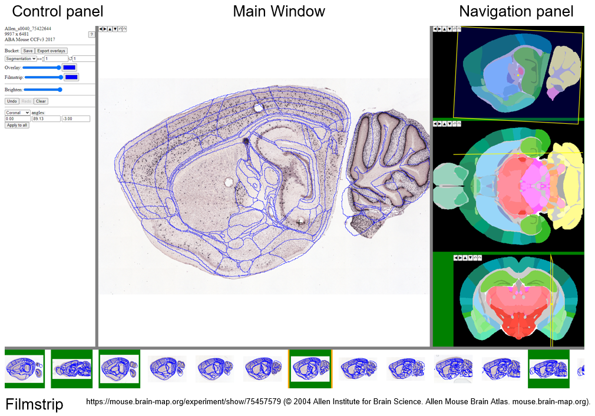

**WebAlign**
============

WebAlign is a tool for registering your sections to a reference brain atlas. Different experimental datasets can be registered to the same atlas allowing spatial integration, analysis and navigation within a standardised coordinate system. 

How to open WebAlign?
------------------------

In "Apps & Analysis", click "WebAlign" and select the image series created in File Creator. Your images will load in the WebAlign app. 

.. image:: images/apps.PNG 

How to register my image series to the atlas?
---------------------------------------------

.. tip::  It is recommended to register one section located in the beginning and end of the series as the first step in the registration process. This is because WebAlign automatically updates the position of remaining sections based on the section numbering, making the registration process more efficient.   

1. Select the image to be registered in the filmstrip. The Main Window shows the selected image with an atlas overlay. The colour of the image border reflects the current registration status (white - not registered, orange - in progress, green - registration saved).

.. tip:: Use the dropdown menu in the Control panel to change the plane through the atlas template from the default coronal plane to a sagittal or horizontal plane to best match your sections.

2. To register a section, move the plane through the atlas to the section's approximate position using the yellow dots in the sagittal, horizontal and coronal windows (Navigation panel). The main window should now show an atlas overlay that roughly matches the appearance of your section.

3.  The main window supports mouse drag in multiple modes for adjusting the atlas overlay to match the outer borders as well as anatomical landmarks within the section (both translation and transformation are supported).  

* Markers are positioned using the "Space bar". Markers are crosses initially and are the fix point of transformations to the atlas overlay. The "Esc key" can be used to remove the marker (in full screen mode the "Esc key" escapes full screen). 
* If there is no marker, or the marker is a cross, mouse drag slides the cut in its plane (translation).
* With a cross in place, press the Up and Down arrows or Left and Right arrows to activate stretch mode (a line will appear). Adjust the atlas overlay to match your section. The panel can be resized towards the left (common border with Control Panel) and towards the bottom (common border with Filmstrip). 

.. note::
  WebAlign performs linear registration only. The registration can be further refined using the WebWarp app.

6. Once a section is registered to a satisfactory standard, save its position by pressing "Save". The registration is then propagated to the remaining sections to help with scaling (visible also in the filmstrip).

7. Go through all the sections, refining the positions and cutting angles, and save the final registrations. Registration is complete when all the images have a green outer border. 

.. note::
  When jumping from one section to the other, wait a few seconds for the image to load.

.. note::
  The "undo" button allows you to go back to the saved position if necessary.

8. To complete the registration, apply fine adjustments with `WebWarp <https://quint-webtools.readthedocs.io/en/latest/WebWarp.html>`_. This step is optional. 

Short keys
----------------
.. list-table:: 
   :widths: 25 25 50
   :header-rows: 1

   * - **To do this**   
     - **Press**  
     - **Description** 
   * -   Place marker     
     -   Space bar 
     -   Markers are the anchor points of most transformations (stretch and rotate)    
   * -   Remove marker
     -   Esc
     -   Removes a previously placed marker 
   * -   Horizontal stretch from maker 
     -   Left/Right arrow keys 
     -   Marker becomes a vertical line, mouse drag horizontally resizes the cut
   * -   Vertical stretch from maker
     -   Up/Down arrow keys
     -   Marker becomes a horizontal line, mouse drag vertically resizes the cut
   * -   Rotate around marker  
     -   PgUp/PgDown	
     -   Marker becomes a cross with a surrounding arc, mouse drag rotates the cut
   * -   In plane adjust   
     -   Click + drag   
     -   If there is no marker, or the marker is a cross, mouse drag slides the cut in its plane (translation)

Control panel
------------------------
.. list-table:: 
   :widths: 25 50
   :header-rows: 1
   
   * - **Button**   
     - **Function**  
   * -   Store     
     -   Store the current alignment and propagate to unaligned sections (Note this does not save the series to your bucket)
   * -   Restore 
     -   Reset the current alignment to the last stored position
   * -   Clear
     -   Reset the current alignment to the default position
   * -   Overlay Slider
     -   Opacity of the atlas overlay, when fully opaque, it becomes an outline
   * -   Overlay color
     -   The outline color
   * -   Filmstrip slider and color
     -   The above settings, applied to the filmstrip
   * -   Save to bucket
     -   Save the series to your bucket (and overwrite the existing file)
   * -   Export overlays
     -   Generates a series of .flat files (for Nutil or similar utility), and stores them into a .zip file in the bucket (re-using the name of the series descriptor, e.g. series13.json will export series13.zip)
     
.. note:: 
 The right border of the control panel can be dragged horizontally, allowing to resize the panel and the main view

Filmstrip
--------------
Drag horizontally to see series, click on a section in order to load it into the main view. The top border of the filmstrip can be dragged vertically, allowing to resize the panel and the main view

Navigation panel
----------------------
Shows the three standard planes centered around the midpoint of the current alignment visible in the main view.

The rectangle of the current cut is projected on each standard plane as a yellow line/rectangle/parallelogram. A small yellow circle represents the midpoint of the projection.

Drag the midpoint around to move the cut.

Drag anywhere else to rotate the cut (inside the given standard plane, around the midpoint)
