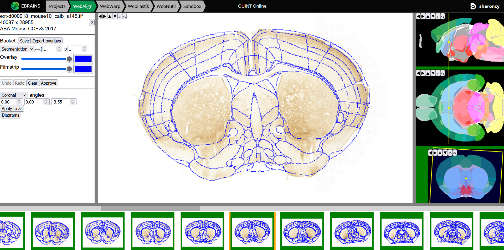

**WebAlign**
============

WebAlign is used to register brain sections to a reference brain atlas using a linear registration method. This involves two key steps:

1. First, establish the series cutting angle using `key anatomical landmarks <https://zenodo.org/records/7575515>`_. The angle is usually stable across the series unless sectioning is performed in two or more blocks. Once the angle is established, adjust the plane through the atlas to match this angle for all the sections. 
2. Second, manually register each section to the atlas by etablishing its position and then adjusting the size and position of the atlas overlays to match the underlying section. 

Once the atlas is correctly registered to the sections using WebAlign, WebWarp can be used to make in-plane nonlinear refinements to match anatomical landmarks. 

**Data from**: Bjerke, I. E et al. (2025). Distribution of calbindin-positive neurons in the normal adult mouse brain (v2) [Data set]. EBRAINS. https://doi.org/10.25493/QVCB-Y3G

**How to use WebAlign?**
---------------------------------------------

1. In your project, Open WebAlign by selecting "Continue to WebAlign". 

.. image:: images/navigate_to_apps.png 

2. Select the section to register in the filmstrip (start with the first and last sections in the series, see tip below). The Main Window shows the selected image with an atlas overlay. The colour of the image border reflects the current registration status (white - not registered, orange - in progress, green - registered).

.. tip::  It is recommended to register one section in the beginning of the series and one section in the end of the series as the first step in the registration process. This is because WebAlign automatically updates the position of remaining sections based on the section numbering, making the registration process more efficient.  

.. tip:: Use the dropdown menu in the Control panel to change the plane through the atlas template from the default coronal plane to a sagittal or horizontal plane to best match your sections.

3. To register a section, move the plane through the atlas to the section's approximate position using the yellow dots in the sagittal, horizontal and coronal windows (Navigation panel). The main window should now show an atlas overlay that roughly matches the appearance of your section.

4.  The main window supports mouse drag in multiple modes for adjusting the atlas overlay to match the outer borders as well as anatomical landmarks within the section (both translation and transformation are supported).  

* Markers are positioned using the "Space bar". Markers are crosses initially and are the anchor point of transformations to the atlas overlay. The "Esc key" can be used to remove the marker (in full screen mode the "Esc key" escapes full screen). 
* If there is no marker, or the marker is a cross, mouse drag slides the cut in its plane (translation).
* With a cross in place, press the Up and Down arrows or Left and Right arrows to activate stretch mode (a line will appear). Adjust the atlas overlay to match your section. The panel can be resized towards the left (common border with Control Panel) and towards the bottom (common border with Filmstrip). 

5. Once a section is registered to a satisfactory standard, save its position by pressing "Save". The registration is then propagated to the remaining sections to help with scaling. To mark up the registration as completed, press "Approve". This will change the registration status from orange (in progress) to green (registered). Note that "Approve" records the registration status for your records, but does not save the results.  

6. Go through all the sections, refining the positions and cutting angles, and save the final registrations. Registration is complete when all the images have a green outer border. 

.. note::
  When jumping from one section to the other, wait a few seconds for the image to load.

.. note::
  The "undo" button allows you to go back to the saved position if necessary.

7. To complete the registration, apply fine adjustments with `WebWarp <https://quint-webtools.readthedocs.io/en/latest/WebWarp.html>`_. This step is optional. 

Short keys
----------------
.. list-table:: 
   :widths: 25 25 50
   :header-rows: 1

   * - **To do this**   
     - **Press**  
     - **Description** 
   * -   Place marker     
     -   Space bar 
     -   Markers are the anchor points of most transformations (stretch and rotate)    
   * -   Remove marker
     -   Esc
     -   Removes a previously placed marker 
   * -   Horizontal stretch from maker 
     -   Left/Right arrow keys 
     -   Marker becomes a vertical line, mouse drag horizontally resizes the cut
   * -   Vertical stretch from maker
     -   Up/Down arrow keys
     -   Marker becomes a horizontal line, mouse drag vertically resizes the cut
   * -   Rotate around marker  
     -   PgUp/PgDown	
     -   Marker becomes a cross with a surrounding arc, mouse drag rotates the cut
   * -   In plane adjust   
     -   Click + drag   
     -   If there is no marker, or the marker is a cross, mouse drag slides the cut in its plane (translation)

Control panel
------------------------
.. list-table:: 
   :widths: 25 50
   :header-rows: 1
   
   * - **Button**   
     - **Function**  
   * -   Save     
     -   Save the current alignment to the bucket and propagate to unaligned sections
   * -   Export overlays
     -   Generates a series of .flat files (for Nutil or similar utility), and stores them into a .zip file in the bucket
   * -   Undo 
     -   Undo the current alignment to the last stored position
   * -   Clear
     -   Reset the current alignment to the default position
   * -   Approve
     -   Mark up the the current alignment as complete (green)
   * -   Center
     -   Adjust and center the cutting plane through the atlas to match the orientation selected in the drop-down menu (coronal, horizontal or sagittal)
   * -   Overlay Slider
     -   Opacity of the atlas overlay, when fully opaque, it becomes an outline
   * -   Overlay color
     -   The outline color
   * -   Filmstrip slider and color
     -   The above settings, applied to the filmstrip
   * -   Diagrams
     -   Open a new window with diagrams displaying the relative position of the sections in atlas space, section spacing, primary and secondary angle.     

     
.. note:: 
 The border of the control panel can be dragged horizontally, allowing resizing of the panel and the main view.

Filmstrip
--------------
Drag horizontally to see series, click on a section in order to load it into the main view. The top border of the filmstrip can be dragged vertically, allowing to resize the panel and the main view

Navigation panel
----------------------
Shows the three standard planes centered around the midpoint of the current alignment visible in the main view.

The rectangle of the current cut is projected on each standard plane as a yellow line/rectangle/parallelogram. A small yellow circle represents the midpoint of the projection.

Drag the midpoint around to move the cut.

Drag anywhere else to rotate the cut (inside the given standard plane, around the midpoint)

Diagrams
-----------

Press the "diagram" button to display graphs showing the relative positions of the sections in atlas space, the spacing of the sections relative to each other, and the primary and secondary angles applied to the sections. These can be used as a guide in the anchoring progress to ensure sections are registered in the correct order, that they do not overlap each other in atlas space, that the angles are consistently applied to all the sections. 
