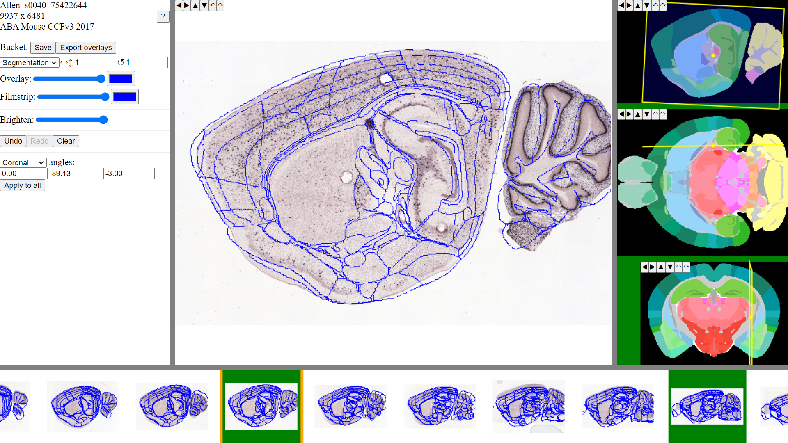

**WebAlign**
============

WebAlign is a tool for spatial registration of serial brain section images to reference 3D atlases. Different experimental datasets registered to the same reference atlas allows you to spatially integrate, analyse and navigate these datasets within a standardised coordinate system. 

Start the registration
-------------------------

The main window shows the selected image with the atlas overlay.

.. tip:: If necessary, change the atlas from coronal view to sagittal or horizontal view (see Navigation panel below).

https://webalign.readthedocs.io/en/latest/
