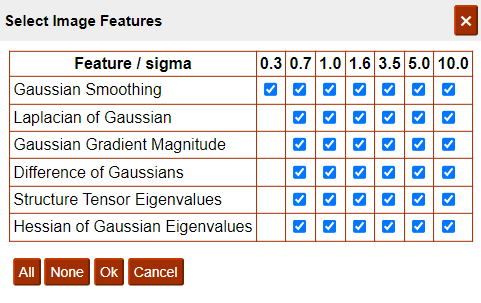
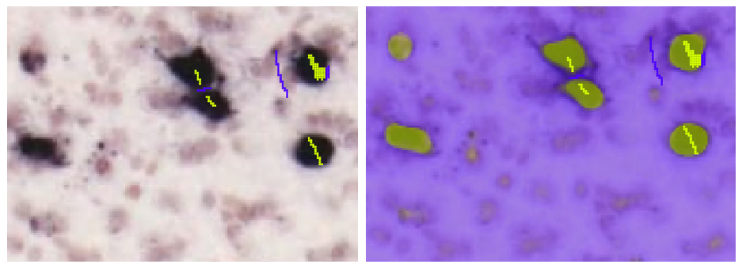
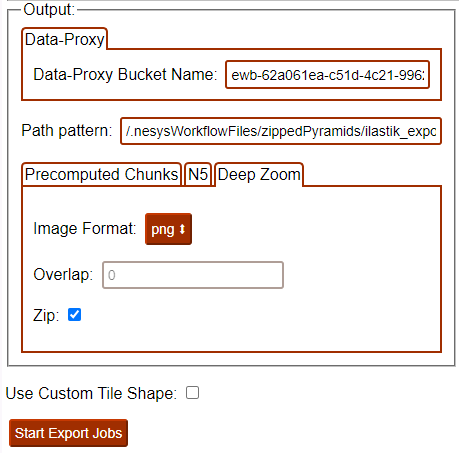

**WebIlastik**
================

* WebIlastik is a tool for image classification and segmentation using supervised machine learning algorithms. 
* You interactively train the classifier on training images to recognise your features-of-interest, e.g. labelled cells, receptors, or markers of pathology. 
* You are then ready to apply the classifier to the whole image series, exporting segmented images to be used in the Nutil app.

How to open WebIlastik?
---------------------------
In “Apps & Analysis”, click “WebIlastik” and select your image series. Request a new session with the "Create" button or rejoin an existing session. 

It can take anything from seconds to minutes for a session to start. Be patient!

.. tip:: The session duration has to be specified in advance. As it takes time to train a good classifier, request at least 60 minutes in the first instance. 

.. image:: images/WebIlastik.PNG
  :align: center
  :width: 500

How to train your classifier?
-------------------------------------------

1. In "Project", save your project so that it can be reloaded at a later stage.
2. In "Training Images", select the images to be used to train your classifier. This is typically a subset of the image series (e.g. 5 sections) with labelling representative of the labelling in the complete series. 
3. To do this, go to "Open from Data Proxy" > "Open File Tree" > press the "folder icon" for your image series to reveal the list of images. Select a subset of the images (or all of them it there are only a few) > "Open". 
4. Select the image resolution to be used to train the classifier. It is possible to work at the original resolution (100%) or at lower resolutions (downscaled images). See the tip. 

.. tip:: Classification is more time consuming for larger images. Images at original resolution may also provide more detail than is needed to extract your features-of-interest (e.g. cells) - a lower resolution may therefore improve the quality of the classification.  

  The optimal resolution is determined by trial and error. As a rough guide, 100% is typically required for intracellular features, 50% - 12.5% for whole cells, and 25 - 12.5% for larger objects such as protein aggregates. 

5. In "Image Features", select all the features.

6. In "Training", use the mouse button to navigate around the image. Press "Ctrl" and the mouse wheel to Zoom in and out. Label some example pixels of each class by selecting "Foreground" or "Background", Press "Alt" to activate paint mode, and use the mouse button to label example pixels of each class. Press "Live update" to view the predictions. Continue training until you are satisfied with the predictions.  

7. In "Export Predictions", select "Simple Segmentations". In "Input Datasets" select all the images in your image series at the resolution used to train your classifier. For "Output" select DeepZoom in PNG format (zip). Press "Start Export Jobs".  

