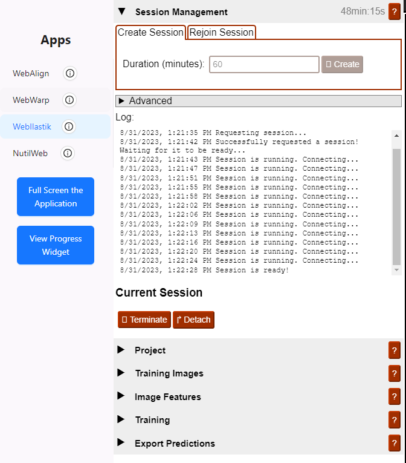

**WebIlastik**
================

WebIlastik is a tool for interactive image classification, segmentation and analysis using supervised machine learning. Using WebIlastik interactively train a classifier to recognise your features-of-interest, e.g. cells, receptors, or markers of pathology. You are then ready to export segmentated images to be used in the Nutil software for regional quantification.  

How to open WebIlastik?
---------------------------
In “Apps & Analysis”, click “WebIlastik” and select the relevant image series. Request a new session with the "Create" button or rejoin an existing session. 

It can take anything from seconds to minutes for a session to start. Be patient!

.. tip:: The session duration has to be specified in advance. It can take time to train a good classifier, so request at least 60 minutes in the first instance. 

How to train your classifier?
-------------------------------------------

1. In the "Project" applet, save your project so that it can be reloaded at a later stage.
2. In the "Training Images" applet, select the images to be used to train your classifier. This is typically a subset of the image series (e.g. 5 sections) with labelling representative of the labelling in the complete series. 
3. To do this, go to "Open from Data Proxy" > "Open File Tree" > press the "folder icon" for the relevant image series to reveal the list of images. Select a subset of the images (or all of them it there are only a few) > "Open". 
3. Select the image resolution to be used to train the classifier. See the tip. 

..tip:: Images at original resolution (100%) can be used to train the classifier. However, there are several downsides to working at high resolution. The classification process is computationally heavy, meaning that it is more time consuming for larger images. Additionally, images at original resolution often provide much more detail than is needed to identify your feature-of-interest (e.g. cells). Since WebIlastik recognises objects within a maximum 10 x 10 pixel window, the quality of the segmentation can be improved by working at a resolution that downscales your feature-of-intest to fit within this window. The optimal resolution is determined by trial and error, with 50%, 25% or 12.5% typically giving good results. 

