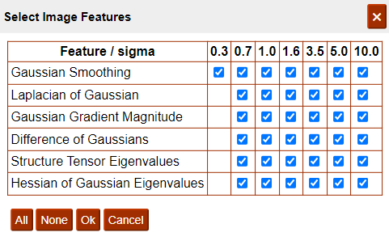
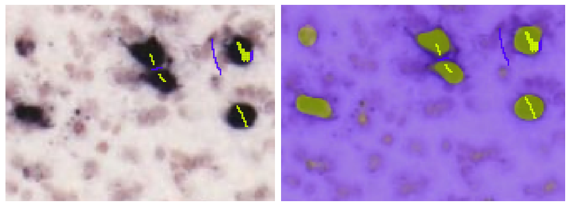
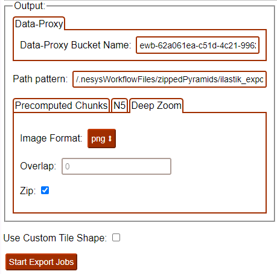

**WebIlastik**
================

Webilastik is an image classification and segmentation tool that can be used to identify the features in your images to quantify using the QUINT workflow. It works by supervised machine learning. In Webilastik, you interactively train a classifier to recognise your features-of-interest, e.g. labelled cells, receptors, or a pathological marker. The training is performed on a subset of your images (training images). Once the classifier is trained, you apply it to the whole image series, creating segmented images displaying your features-of-interest in a unique colour (RGB), to be used in the WebNutil application. 

How to train your classifier?
-------------------------------------------

1. Click "Training Images" and select the images to use to train your classifier. This is typically a subset of the image series with labelling representative of the labelling in the whole series (for example, 5 sections). This will add the training images to a Quick-Switch menu, where you can easily switch between images.
2. Select an image in the Quick-Switch menu. It will automatically open in the Webilastik viewer. 
3. Select the image resolution to be used to train the classifier. It is possible to work at the original resolution (100%) or at lower resolutions (downscaled images). However, we recommend selecting the lowest resolution that allows you to differentiate between the labelling-of-interest and the background. See the tip. 

.. tip:: Classification is more time consuming for larger images and may not produce as good results. This is because higher resolutions may provide more detail than is needed to identify the features-of-interest (for example, cells). This may "confuse" the algorithm leading to artifacts being extracted. A lower resolution typically improves the quality of the classification, as long as it is possible to differentiate the features-of-interest from background and artifacts.  

  The optimal resolution is determined by trial and error. As a rough guide, for original resolution images, 50% is typically required for intracellular features, 25% - 12.5% for whole cells, and 25 - 12.5% for larger objects such as protein aggregates. 

5. In "Features", all the features are included in the machine-learning model by default. While it is possible to limit the features and scales used in the model, this is not recommended in the first instance. 

  

6. Use the "Tools" to train your machine-learning model. Select "pan" to navigate the image (use the arrow to navigate and the mouse wheel to Zoom in and out). Select "Brush" to annotate your image. Select "Foreground" and "Background" and annotate example pixels of each class. 
7. Once you've added annotations of each class you're ready to train the classifier. Select "Train classifier" to activate the model. This will automatically display predictions on the image. Continue adding annotations and training the classifier until you are satisfied with the predictions. To inspect the classifier on a new image, use the Quick-Switch menu. It is possible to train the algorithm using multiple images. 

8. Once you're happy with the classifier, press "Segment your images".

