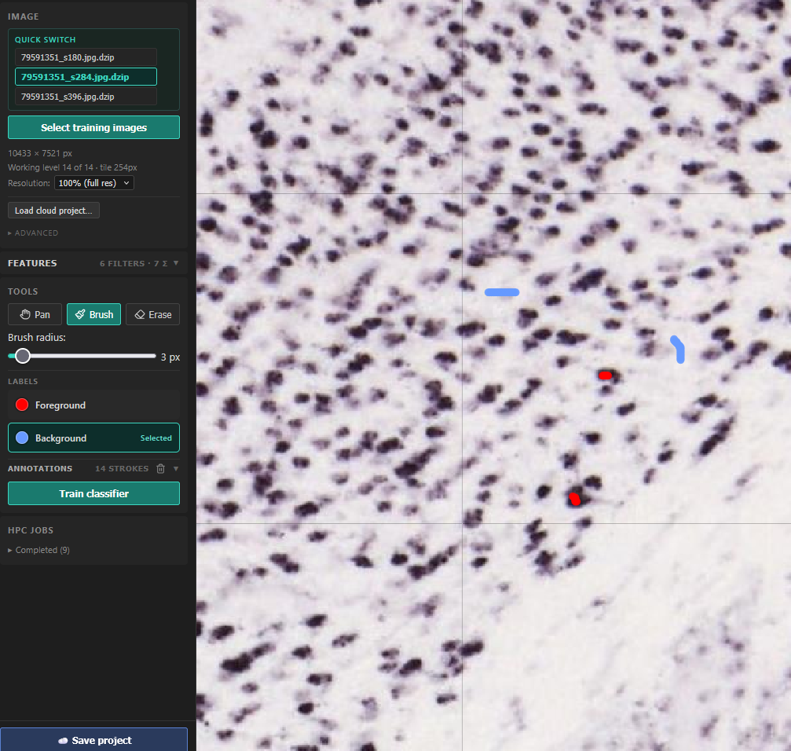

**Webilastik**
================

Webilastik is an image classification and segmentation tool that works by supervised machine learning. It can be used to identify the features in your images to quantify using the QUINT workflow (for example, cells, receptors or a pathological marker). It is possible to skip this step and instead upload your own segmentations produced with an alternative software such as QuPath or the desktop version of ilastik.    

How to train your classifier?
-------------------------------------------

1. Click "Training Images" and select the images to use to train your classifier. Select a subset of your image series with labelling representative of the labelling in the whole series (for example, 5 sections). This adds the training images to a Quick-Switch menu, where you can easily switch between images.
2. Select an image in the Quick-Switch menu. It will open in the Webilastik viewer. 
3. Select the image resolution to be used to train the classifier (for example, 25% of original size). We recommend selecting the lowest resolution that allows you to differentiate the labelling from the background (see the tip). As a rough guide, assuming you have images exported directly from the microscope (not previously downscaled), 25% - 12.5% resolution is usually works well for labelled cells, 25% - 12.5% for larger objects such as protein aggregates, while 50% may be needed for intracellular features. 

.. tip:: Classification is more time consuming for larger images (such as 100% resolution) and may not produce good results. This is because higher resolutions typically provide more detail than is needed to identify the features-of-interest (for example, cells), which may "confuse" the algorithm leading to artifacts being extracted. A lower resolution typically improves the quality of classification, as long as it is possible to differentiate the features-of-interest from background and artifacts.  

5. In "Features", select the features to include in the algorithm (all the features are included by default). While it is possible to limit the features and scales used in the model, this is not recommended. 
6. Use "Tools" to train your machine-learning model. Select "Pan" to navigate the image (use the arrow to navigate and the mouse wheel to Zoom in and out). Select "Brush" to annotate your image. Select "Foreground" and "Background"  and annotate example pixels of each class. The "Erase" button allows you to remove annotations.
7. Once you've added annotations for each class you're ready to train the classifier. Select "Train classifier" to activate the model. This will automatically display predictions on the image. Continue adding annotations until you are satisfied with the predictions. To inspect the classifier on a new image, swithc to a new image using the Quick-Switch menu. It is possible to train the algorithm using multiple images. 
8. Once you're happy with the classifier, press "Segment all images" and wait until the process has completed (this will take some time). Once the files appear in the WebNutil app, you can inspect the result using the viewer ("Compare overlayed segmentations").

