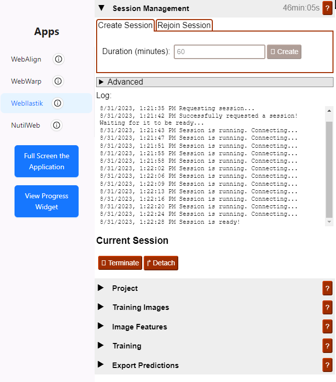

**WebIlastik**
================

WebIlastik is a tool for identifying the features that you want to quantify in the images. 

How to open WebIlastik?
---------------------------
In “Apps & Analysis”, click “WebIlastik” and select the image series that you want to work with. Request a new session with the "Create" button or rejoin an existing session. 

It can take anything from seconds to minutes for a session to start. Be patient!

.. tip:: The session duration has to be specified in advance. It takes time to train your classifier, so select at least 60 minutes in the first instance. 

