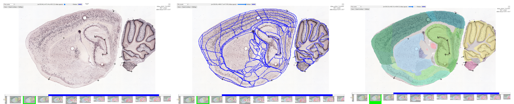

**WebWarp**
============
WebWarp is a tool for making nonlinear refinements to the atlas registration achieved with WebAlign. Adjustment to the atlas overlays are applied manually by drop and drag of markers placed on the image. 

How to access WebWarp?
----------------------------
In “Apps & Analysis”, click “WebWarp”. Select the image series that has already been registered to the atlas using the WebAlign tool. Your images will load in WebWarp.

How to make adjustments?
-------------------------

1. Your registered images are visible in the main window. Adjust the appearance of the atlas overlay with the transparency slider titled “Atlas opacity”. The color of the atlas outline can be modified by clicking on the coloured rectangle.
2. Place a marker on the part of the atlas overlay that you wish to adjust by pressing the space bar. Adjustments are made by dragging the marker using the mouse.
3. To remove a marker, position the mouse cursor over the marker and press Delete or Backspace. 
4. To view the transformations applied to the atlas, go to “Settings” and “show triangles”. 

.. tip::
 A good strategy is to place markers around the contour of the section first, and then proceed by refining the inner parts.
 
 Try to keep the number of markers to a minimum. 

5. Once you are satisfied with the result, press the "Save" button and export the atlas overlays with the "Export overlays" button. 

6. You are now ready to extract your features with `WebIlastik <https://quint-webtools.readthedocs.io/en/latest/WebIlastik.html>`_.
 
